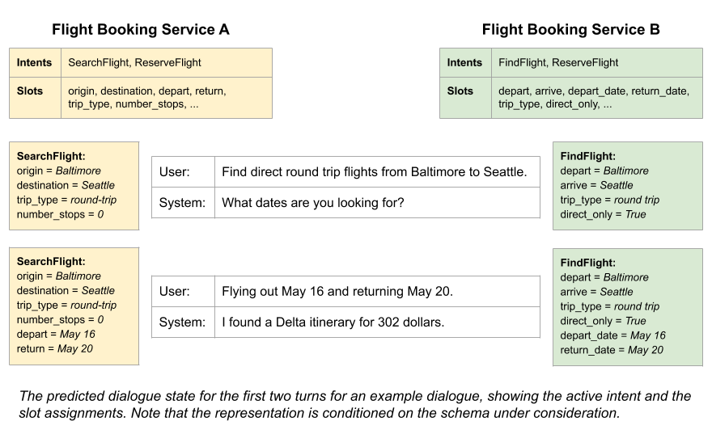

# Schema-Guided Dialogue State Tracking [(DSTC 8)](https://sites.google.com/dstc.community/dstc8)

*This is the page for the Dialogue System Technology Challenge concluded in
2019.*

**Organizers -** Abhinav Rastogi, Xiaoxue Zang, Raghav Gupta, Srinivas Sunkara,
Pranav Khaitan

**Contact -** schema-guided-dst@google.com

## Important Links

1. [Registration form](https://forms.gle/qWwojMR5pAy4KjSu7)
2. [Baseline model](https://github.com/google-research/google-research/tree/master/schema_guided_dst)
3. [Paper for dataset and baseline](https://arxiv.org/pdf/1909.05855.pdf)

Please cite the following paper for the dataset or the baseline model:

```shell
@article{rastogi2019towards,
  title={Towards Scalable Multi-domain Conversational Agents: The Schema-Guided Dialogue Dataset},
  author={Rastogi, Abhinav and Zang, Xiaoxue and Sunkara, Srinivas and Gupta, Raghav and Khaitan, Pranav},
  journal={arXiv preprint arXiv:1909.05855},
  year={2019}
}
```

## Important Dates


|                                                 | Date                  |
| ----------------------------------------------- | :-------------------- |
| Task description released.                      | 06/17/2019            |
| Sample data released. Development phase begins. | 06/18/2019            |
| Single domain dataset (train + dev) released    | 07/07/2019            |
| Multi domain dataset (train + dev) released     | 07/23/2019            |
| Evaluation Scripts released                     | 08/06/2019            |
| Baseline Released                               | 09/02/2019            |
| Test dataset released and test phase begins.    | 10/07/2019            |
| Entry submission deadline.                      | 10/14/2019            |
| Objective evaluation completed.                 | 10/20/2019            |


### Updates

**10/12/2019** - Entry submission deadline is extended to 10/14/2019.

**10/07/2019** - Test dataset released and test phase begins. Please remember
that the entry submission deadline is 10/13/2019.

**10/02/2019** - Registration form for participants released. Registrations
will be open till 10/12/2019. Link to dataset paper and baseline model added.

**09/02/2019** - The baseline model has been released. The source code for the
model and the reported metrics on the dev set can be found
[here](https://github.com/google-research/google-research/tree/master/schema_guided_dst).

**08/31/2019** - Issue with dialogue state fixed in single and multi domain
dialogues. Only slots which are present in required/optional slots of an intent
can be present in the dialogue state. The list of slots removed from the
dialogue state as a result of this change are: ('Alarm_1', 'alarm_time'),
('Calendar_1', 'available_start_time'), ('Hotels_1', 'price_per_night'),
('Hotels_2', 'address'), ('Movies_2', 'title'), ('RentalCars_1', 'car_name'),
('RentalCars_2', 'car_name'), ('Travel_1', 'attraction_name'), ('Weather_1',
'temperature').

**08/06/2019** - Scripts for evaluation and computing the different metrics
have been released. You can access them
[here](https://github.com/google-research/google-research/tree/master/schema_guided_dst).
The expected date for baseline release has been updated. We apologize
for any inconvenience caused by the delay in releasing the baseline.

**07/23/2019** - Train and dev sets for multi domain dataset have been released.
The dataset files have been renamed to accommodate additional dialogues in the
multi domain dataset. The expected date for baseline release has been updated.
We apologize for any inconvenience caused by these delays resulting from factors
beyond our control.

**07/18/2019** - The fields that will be missing from the unlabelled test data
have been added to the [Dialogue Representation](#dialogue-representation)
section.

**07/07/2019** - Train and dev sets for the
[single domain dataset](#single-domain-dataset) have been released. The baseline
system will be released with the multi domain dataset on 07/19/2019. The sample
dialogues released earlier in `train/dialogues_1.json` have been moved to
`train/dialogues_43.json`.

**06/30/2019** - Due to some unforeseen delays, the single domain dataset is
expected to be released on 07/07/2019. The other dates are unchanged.

## Introduction

Virtual assistants such as the Google Assistant, Alexa, Siri, Cortana etc. help
users accomplish tasks by providing a natural language interface to service
providers (backends/APIs). Such assistants need to support an ever-increasing
number of services and APIs. Building a dialogue system that can seamlessly
operate across all these services is the holy grail of conversational AI. The
Schema-Guided State Tracking track in the 8th Dialogue System Technology
Challenge explores dialogue state tracking in such a setting. This challenge is
aimed to encourage research on multi-domain dialogue systems that can
efficiently interface with a large number of services/APIs. We have taken a few
other practical considerations (e.g, defining a large variety of slot types, not
providing a list of all possible values for some slots etc.) while creating this
dataset to closely mimic the real world use cases.

Under the schema-guided approach, the dialogue state representation is based on
the schemas for the services under consideration (see figure below for an
example). Each dialogue in the dataset is accompanied by schemas listing a set
of user intents and slots, and a sentence describing their semantics in natural
language. The dialogue state needs to be predicted over these intents and slots.
Such a setup ensures that the system learns to recognize the semantics of
intents and slots from their descriptions, rather than just treating them as
labels, thus allowing zero-shot generalization to new schemas. Furthermore, this
approach enables the system to recognize patterns across domains (e.g, slots for
date or time are specified in a similar manner across different services)
without providing an explicit alignment between slots of different services.



## Data

The dataset consists of conversations between a virtual assistant and a user.
These conversations have been generated with the help of a dialogue simulator
and paid crowd-workers using an approach similar to that outlined
[here](https://arxiv.org/pdf/1801.04871.pdf). The details and code for the
dialogue simulator will be made public after the competition. **The dataset is
provided "AS IS" without any warranty, express or implied. Google disclaims all
liability for any damages, direct or indirect, resulting from the use of the
dataset.**

### Schema Representation

A schema is a normalized representation of the interface exposed by a
service/API. The schemas have been manually generated by the dataset creators.
This representation of schema has been chosen to reflect real world
services/APIs by imposing the following restrictions:

1.  **Arbitrary calls are not allowed.** A service/API only offers a limited
    number of ways to call it. E.g, a call to a restaurant search API may only
    be made once the location and cuisine are known. Although this doesn't
    impact the dialogue state tracking task directly, it has implications on the
    flow of the dialogue (e.g, the system must gather the value of all required
    slots from the user before making a service call), which participants may
    exploit.
2.  **The list of all possible entities is not accessible.** Many services don't
    expose the set of all available entities (defined as an assignment of values
    to all slots or a single row in the underlying database), and for others
    this list could be very large or dynamic. So, we don't provide a list of all
    possible entities. *This rules out approaches which represent dialogue state
    as a distribution over the set of all possible entities.*
3.  **The list of all values taken by a slot is not provided for some slots.**
    Obtaining the list of all possible values taken by some slots is not
    feasible because this could be very large (restaurant name, city etc.),
    unbounded (date, time, username etc.) or dynamic (movie, song etc.) *This
    rules out approaches which represent dialogue state as set of distribution
    over the set of all possible values of a slot, or which iterate over all
    possible slot values.* The list of all possible values is provided for some
    slots like price range, star rating, number of people etc, where it is
    natural to do so.

The schema for a service contains the following fields:

*   **service_name** - A unique name for the service.
*   **description** - A natural language description of the tasks supported by
    the service.
*   **slots** - A list of slots/attributes corresponding to the entities present
    in the service. Each slot contains the following fields:
    *   **name** - The name of the slot.
    *   **description** - A natural language description of the slot.
    *   **is_categorical** - A boolean value. If it is true, the slot has a
        fixed set of possible values.
    *   **possible_values** - List of possible values the slot can take. If the
        slot is a categorical slot, it is a complete list of all the possible
        values. If the slot is a non categorical slot, it is either an empty
        list or a small sample of all the values taken by the slot.
*   **intents** - The list of intents/tasks supported by the service. Each
    method contains the following fields:
    *   **name** - The name of the intent.
    *   **description** - A natural language description of the intent.
    *   **is_transactional** - A boolean value. If true, indicates that the
        underlying API call is transactional (e.g, a booking or a purchase), as
        opposed to a search call.
    *   **required_slots** - A list of slot names whose values must be provided
        before making a call to the service.
    *   **optional_slots** - A dictionary mapping slot names to the default
        value taken by the slot. These slots may be optionally specified by the
        user and the user may override the default value. An empty default value
        allows that slot to take any value by default, but the user may override
        it.

### Dialogue Representation

The dialogue is represented as a list of turns, where each turn contains either
a user or a system utterance. The annotations for a turn are grouped into
frames, where each frame corresponds to a single service. Each turn in the
single domain dataset contains exactly one frame. In multi-domain datasets, some
turns may have multiple frames.

Each dialogue is represented as a json object with the following fields:

*   **dialogue_id** - A unique identifier for a dialogue.
*   **services** - A list of services present in the dialogue.
*   **turns** - A list of annotated system or user utterances.

Each turn consists of the following fields:

*   **speaker** - The speaker for the turn. Possible values are "USER" or
    "SYSTEM".
*   **utterance** - A string containing the natural language utterance.
*   **frames** - A list of frames, each frame containing annotations for a
    single service.

Each frame consists of the fields listed below. The fields marked with * will
be excluded from all user turns in the test data released to the participants.

*   **service** - The name of the service corresponding to the frame. The slots
    and intents used in the following fields are taken from the schema of this
    service.
*   **slots*** - A list of slot spans in the utterance, only provided for
    non-categorical slots. Each slot span contains the following fields:
    *   **slot** - The name of the slot.
    *   **start** - The index of the starting character in the utterance
        corresponding to the slot value.
    *   **exclusive_end** - The index of the character just after the last
        character corresponding to the slot value in the utterance. In python,
        `utterance[start:exclusive_end]` gives the slot value.
*   **actions** (system turns only) - A list of actions corresponding to the
    system. Each action has the following fields:
    *   **act** - The type of action. The list of all possible system acts is
        given below.
    *   **slot** (optional)- A slot argument for some of the actions.
    *   **values** (optional)- A list of values assigned to the slot. If the
        values list is non-empty, then the slot must be present.
*   **state*** (user turns only) - The dialogue state corresponding to the
    service. It consists of the following fields:
    *   **active_intent** - The intent corresponding to the service of the frame
        which is currently being fulfilled by the system. It takes the value
        "NONE" if none of the intents are active.
    *   **requested_slots** - A list of slots requested by the user in the
        current turn.
    *   **slot_values** - A dictionary mapping slot name to a list of strings.
        For categorical slots, this list contains a single value assigned to the
        slot. For non-categorical slots, all the values in this list are spoken
        variations of each other and are equivalent (e.g, "6 pm", "six in the
        evening", "evening at 6" etc.).

List of possible system acts:

*   **INFORM** - Inform the value for a slot to the user. The slot and values
    fields in the corresponding action are always non-empty.
*   **REQUEST** - Request the value of a slot from the user. The corresponding
    action always contains a slot, but values are optional. When values are
    present, they are used as examples for the user e.g, "Would you like to eat
    indian or chinese food or something else?"
*   **CONFIRM** - Confirm the value of a slot before making a transactional
    service call.
*   **OFFER** - Offer a certain value for a slot to the user. The corresponding
    action always contains a slot and a list of values for that slot offered to
    the user.
*   **NOTIFY_SUCCESS** - Inform the user that their request was successful. Slot
    and values are always empty in the corresponding action.
*   **NOTIFY_FAILURE** - Inform the user that their request failed. Slot and
    values are always empty in the corresponding action.
*   **INFORM_COUNT** - Inform the number of items found that satisfy the user's
    request. The corresponding action always has "count" as the slot, and a
    single element in values for the number of results obtained by the system.
*   **OFFER_INTENT** - Offer a new intent to the user. Eg, "Would you like to
    reserve a table?". The corresponding action always has "intent" as the slot,
    and a single value containing the intent being offered. The offered intent
    belongs to the service corresponding to the frame.
*   **REQ_MORE** - Asking the user if they need anything else. Slot and values
    are always empty in the corresponding action.
*   **GOODBYE** - End the dialogue. Slot and values are always empty in the
    corresponding action.

### The Dialogue State

The dialogue state is the system's estimate of the user's goal based on the
dialogue context. It is used to identify the appropriate service call to make
and to assign values to different slots required by the service. The state is
also used by the system to generate the next actions. Please note that only
those slots which are either required or optional slots for any intent in a
service can be present in the dialogue state.

In our setup, a separate dialogue state is maintained for each service in the
corresponding frame. All turns in a single domain dialogue have exactly one
frame. However, turns in multi-domain dialogues may have more than one frame.
Only those turns in which the service changes can have more than one frame. All
other turns have a single frame just like single domain dialogues.

The dialogue state is only available for user turns. Within a frame, the
dialogue state contains information about the active intent for the
corresponding service, the set of slots whose values are requested by the user
in the current turn and the values assigned to different slots in the service
based on the dialogue context. The values assigned to different slots are
represented as a list. For categorical slots, this list takes exactly one value,
and this value is listed in the schema. Arbitrary string values are supported
for non-categorical slots. We constrain these values to be substrings in the
user or the system utterance. For such slots, the list of values contains all
variations for the same value over the dialogue seen till the current turn (e.g,
"6 pm", "six in the evening", "evening at 6" are spoken variations for the same
value). The state tracker can output any of these variations. This decision was
made to avoid the additional complexity of obtaining the canonicalized version
of a value on the dialogue state tracker. In the real world, this
canonicalization can be done by the service being called or by a separate
module. For date slots, some of the dialogues contain a relative quantifier
(e.g, "today", "tomorrow", "next thursday" etc.). For these values, March 1st,
2019 has been treated as today's date for all dialogues.

### Dataset Statistics

The dataset consists of two kinds of dialogues.

| Type of Dialogue | Train files                                  | Dev files                                    | Test Files                                   |
| ---------------- | :------------------------------------------: | :------------------------------------------: | :------------------------------------------: |
| Single Domain    | `dialogues_001.json` to `dialogues_043.json` | `dialogues_001.json` to `dialogues_007.json` | `dialogues_001.json` to `dialogues_011.json` |
| Multi Domain     | `dialogues_044.json` to `dialogues_127.json` | `dialogues_008.json` to `dialogues_020.json` | `dialogues_012.json` to `dialogues_034.json` |

The single domain dialogues involve interactions with a single service, possibly
over multiple intents. The multi-domain dialogues have interactions involving
intents belonging to two or more different services. The multi-domain dialogues
also involve transfer of dialogue state values from one service to the other
wherever such a transfer is deemed natural. Eg, if a user finds a restaurant and
searches for a movie next, the dialogue state for movie service is already
initialized with the location from the dialogue state for restaurant service.

The overall statistics of the train and dev sets are given below. The term
*informable slots* refers to the slots over which the user can specify a
constraint. For example, slots like *phone_number* are not informable.

<table>
    <tr>
        <th rowspan="2"></th>
        <th colspan="3">Train</th><th colspan="3">Dev</th><th colspan="3">Test</th>
    </tr>
    <tr>
        <td>Single-domain</td>
        <td>Multi-domain</td>
        <td>Combined</td>
        <td>Single-domain</td>
        <td>Multi-domain</td>
        <td>Combined</td>
        <td>Single-domain</td>
        <td>Multi-domain</td>
        <td>Combined</td>
    </tr>
    <tr>
        <td>No. of dialogues</td>
        <td align="center">5,403</td>
        <td align="center">10,739</td>
        <td align="center">16,142</td>
        <td align="center">836</td>
        <td align="center">1,646</td>
        <td align="center">2,482</td>
        <td align="center">1,331</td>
        <td align="center">2,870</td>
        <td align="center">4,201</td>
    </tr>
    <tr>
        <td>No. of turns</td>
        <td align="center">82,588</td>
        <td align="center">247,376</td>
        <td align="center">329,964</td>
        <td align="center">11,928</td>
        <td align="center">36,798</td>
        <td align="center">48,726</td>
        <td align="center">16,850</td>
        <td align="center">67,744</td>
        <td align="center">84,594</td>
    </tr>
    <tr>
        <td>No. of tokens (lower-cased)</td>
        <td align="center">807,562</td>
        <td align="center">2,409,857</td>
        <td align="center">3,217,419</td>
        <td align="center">117,492</td>
        <td align="center">353,381</td>
        <td align="center">470,873</td>
        <td align="center">166,329</td>
        <td align="center">713,731</td>
        <td align="center">880,060</td>
    </tr>
     <tr>
        <td>Average turns per dialogue</td>
        <td align="center">15.286</td>
        <td align="center">23.035</td>
        <td align="center">20.441</td>
        <td align="center">14.268</td>
        <td align="center">22.356</td>
        <td align="center">19.632</td>
        <td align="center">12.660</td>
        <td align="center">23.604</td>
        <td align="center">20.137</td>
    </tr>
    <tr>
        <td>Average tokens per turn</td>
        <td align="center">9.778</td>
        <td align="center">9.742</td>
        <td align="center">9.751</td>
        <td align="center">9.850</td>
        <td align="center">9.603</td>
        <td align="center">9.664</td>
        <td align="center">9.871</td>
        <td align="center">10.536</td>
        <td align="center">10.403</td>
    </tr>
    <tr>
        <td>Total unique tokens (lower-cased)</td>
        <td align="center">16,350</td>
        <td align="center">25,459</td>
        <td align="center">30,349</td>
        <td align="center">6,803</td>
        <td align="center">10,533</td>
        <td align="center">12,719</td>
        <td align="center">7,213</td>
        <td align="center">14,888</td>
        <td align="center">16,382</td>
    </tr>
    <tr>
        <td>Total no. of slots</td>
        <td align="center">201</td>
        <td align="center">214</td>
        <td align="center">214</td>
        <td align="center">134</td>
        <td align="center">132</td>
        <td align="center">136</td>
        <td align="center">157</td>
        <td align="center">158</td>
        <td align="center">159</td>
    </tr>
    <tr>
        <td>Total no. of informable slots</td>
        <td align="center">138</td>
        <td align="center">144</td>
        <td align="center">144</td>
        <td align="center">89</td>
        <td align="center">87</td>
        <td align="center">89</td>
        <td align="center">109</td>
        <td align="center">110</td>
        <td align="center">111</td>
    </tr>
    <tr>
        <td>Total unique slot values (lower-cased)</td>
        <td align="center">7,070</td>
        <td align="center">11,635</td>
        <td align="center">14,139</td>
        <td align="center">2,418</td>
        <td align="center">4,182</td>
        <td align="center">5,101</td>
        <td align="center">2,492</td>
        <td align="center">5,847</td>
        <td align="center">6,533</td>
    </tr>
    <tr>
        <td>Total unique informable slot values (lower-cased)</td>
        <td align="center">3,742</td>
        <td align="center">6,348</td>
        <td align="center">7,661</td>
        <td align="center">1,137</td>
        <td align="center">2,118</td>
        <td align="center">2,524</td>
        <td align="center">1,387</td>
        <td align="center">3,323</td>
        <td align="center">3,727</td>
    </tr>
    <tr>
        <td>Total domains</td>
        <td align="center">14</td>
        <td align="center">16</td>
        <td align="center">16</td>
        <td align="center">16</td>
        <td align="center">15</td>
        <td align="center">16</td>
        <td align="center">17</td>
        <td align="center">18</td>
        <td align="center">18</td>
    </tr>
    <tr>
        <td>Total services</td>
        <td align="center">24</td>
        <td align="center">26</td>
        <td align="center">26</td>
        <td align="center">17</td>
        <td align="center">16</td>
        <td align="center">17</td>
        <td align="center">20</td>
        <td align="center">21</td>
        <td align="center">21</td>
    </tr>
    <tr>
        <td>Total intents</td>
        <td align="center">35</td>
        <td align="center">37</td>
        <td align="center">37</td>
        <td align="center">28</td>
        <td align="center">26</td>
        <td align="center">28</td>
        <td align="center">33</td>
        <td align="center">34</td>
        <td align="center">35</td>
    </tr>
</table>

The following table shows how the dialogues and services are distributed among
different domains for the train and dev sets. In this table, each multi-domain
dialogue contirbutes to the count of every service present in the dialogue.
Please note that a few domains like *Travel* and *Weather* are only present in
the dev set. This is to test the generalization of models on unseen domains. The
test set will similarly have some unseen domains which are neither present in
the training nor in the dev set. Also, the number in parenthesis represents the
number of unique services belonging to the corresponding domain.

* In the first column, it indicates the number of unique services for the
  domain in Train, Dev and Test datasets combined.
* In the fourth column, it indicates the number of such unique services in the
  Train dataset only.
* In the seventh column, it indicates the number of such unique services in
  the Dev dataset only.
* In the last column, it indicates the number of such unique services in the
  Test dataset only.

<table>
    <tr>
        <th rowspan="2"></th>
        <th colspan="3"># Dialogues <br> Train</th>
        <th colspan="3"># Dialogues <br> Dev</th>
        <th colspan="3"># Dialogues <br> Test</th>
    </tr>
    <tr>
        <td>Single-domain</td>
        <td>Multi-domain</td>
        <td>Combined</td>
        <td>Single-domain</td>
        <td>Multi-domain</td>
        <td>Combined</td>
        <td>Single-domain</td>
        <td>Multi-domain</td>
        <td>Combined</td>
    </tr>
    <tr>
        <td>Alarm (1)</td>
        <td align="center">NA</td>
        <td align="center">NA</td>
        <td align="center">NA</td>
        <td align="center">37</td>
        <td align="center">NA</td>
        <td align="center">37 (1)</td>
        <td align="center">47</td>
        <td align="center">240</td>
        <td align="center">287 (1)</td>
    </tr>
    <tr>
        <td>Banks (2)</td>
        <td align="center">207</td>
        <td align="center">520</td>
        <td align="center">727 (1)</td>
        <td align="center">42</td>
        <td align="center">252</td>
        <td align="center">294 (1)</td>
        <td align="center">NA</td>
        <td align="center">NA</td>
        <td align="center">NA</td>
    </tr>
    <tr>
        <td>Buses (3)</td>
        <td align="center">310</td>
        <td align="center">1,970</td>
        <td align="center">2,280 (2)</td>
        <td align="center">44</td>
        <td align="center">285</td>
        <td align="center">329 (1)</td>
        <td align="center">88</td>
        <td align="center">438</td>
        <td align="center">526 (1)</td>
    </tr>
    <tr>
        <td>Calendar (1)</td>
        <td align="center">169</td>
        <td align="center">1,433</td>
        <td align="center">1,602 (1)</td>
        <td align="center">NA</td>
        <td align="center">NA</td>
        <td align="center">NA</td>
        <td align="center">NA</td>
        <td align="center">NA</td>
        <td align="center">NA</td>
    </tr>
    <tr>
        <td>Events (3)</td>
        <td align="center">788</td>
        <td align="center">2,721</td>
        <td align="center">3,509 (1)</td>
        <td align="center">73</td>
        <td align="center">345</td>
        <td align="center">418 (1)</td>
        <td align="center">76</td>
        <td align="center">516</td>
        <td align="center">592 (1)</td>
    </tr>
    <tr>
        <td>Flights (4)</td>
        <td align="center">985</td>
        <td align="center">1,762</td>
        <td align="center">2,747 (2)</td>
        <td align="center">94</td>
        <td align="center">297</td>
        <td align="center">391 (1)</td>
        <td align="center">87</td>
        <td align="center">419</td>
        <td align="center">506 (1)</td>
    </tr>
        <tr>
        <td>Homes (2)</td>
        <td align="center">268</td>
        <td align="center">579</td>
        <td align="center">847 (1)</td>
        <td align="center">81</td>
        <td align="center">99</td>
        <td align="center">180 (1)</td>
        <td align="center">89</td>
        <td align="center">157</td>
        <td align="center">246 (1)</td>
    </tr>
        <tr>
        <td>Hotels (4)</td>
        <td align="center">457</td>
        <td align="center">2,896</td>
        <td align="center">3,353 (3)</td>
        <td align="center">56</td>
        <td align="center">521</td>
        <td align="center">577 (2)</td>
        <td align="center">177</td>
        <td align="center">885</td>
        <td align="center">1062 (2)</td>
    </tr>
        <tr>
        <td>Media (3)</td>
        <td align="center">281</td>
        <td align="center">832</td>
        <td align="center">1,113 (1)</td>
        <td align="center">46</td>
        <td align="center">133</td>
        <td align="center">179 (1)</td>
        <td align="center">80</td>
        <td align="center">284</td>
        <td align="center">364 (1)</td>
    </tr>
        <tr>
        <td>Messaging (1)</td>
        <td align="center">NA</td>
        <td align="center">NA</td>
        <td align="center">NA</td>
        <td align="center">NA</td>
        <td align="center">NA</td>
        <td align="center">NA</td>
        <td align="center">NA</td>
        <td align="center">298</td>
        <td align="center">298 (1)</td>
    </tr>
        <tr>
        <td>Movies (2)</td>
        <td align="center">292</td>
        <td align="center">1,325</td>
        <td align="center">1,617 (1)</td>
        <td align="center">47</td>
        <td align="center">94</td>
        <td align="center">141 (1)</td>
        <td align="center">132</td>
        <td align="center">449</td>
        <td align="center">581</td>
    </tr>
        <tr>
        <td>Music (3)</td>
        <td align="center">394</td>
        <td align="center">896</td>
        <td align="center">1,290 (2)</td>
        <td align="center">35</td>
        <td align="center">161</td>
        <td align="center">196 (1)</td>
        <td align="center">25</td>
        <td align="center">322</td>
        <td align="center">347 (2)</td>
    </tr>
        <tr>
        <td>Payment (1)</td>
        <td align="center">NA</td>
        <td align="center">NA</td>
        <td align="center">NA</td>
        <td align="center">NA</td>
        <td align="center">NA</td>
        <td align="center">NA</td>
        <td align="center">36</td>
        <td align="center">186</td>
        <td align="center">222 (1)</td>
    </tr>
        <tr>
        <td>RentalCars (3)</td>
        <td align="center">215</td>
        <td align="center">1,370</td>
        <td align="center">1,585 (2)</td>
        <td align="center">39</td>
        <td align="center">342</td>
        <td align="center">381 (1)</td>
        <td align="center">64</td>
        <td align="center">480</td>
        <td align="center">544 (1)</td>
    </tr>
        <tr>
        <td>Restaurants (2)</td>
        <td align="center">367</td>
        <td align="center">2052</td>
        <td align="center">2,419 (1)</td>
        <td align="center">73</td>
        <td align="center">263</td>
        <td align="center">336 (1)</td>
        <td align="center">73</td>
        <td align="center">390</td>
        <td align="center">463 (1)</td>
    </tr>
        <tr>
        <td>RideSharing (2)</td>
        <td align="center">119</td>
        <td align="center">1,584</td>
        <td align="center">1,703 (2)</td>
        <td align="center">45</td>
        <td align="center">225</td>
        <td align="center">270 (1)</td>
        <td align="center">34</td>
        <td align="center">216</td>
        <td align="center">250 (1)</td>
    </tr>
        <tr>
        <td>Services (4)</td>
        <td align="center">551</td>
        <td align="center">1,338</td>
        <td align="center">1,889 (3)</td>
        <td align="center">44</td>
        <td align="center">157</td>
        <td align="center">201 (1)</td>
        <td align="center">167</td>
        <td align="center">489</td>
        <td align="center">656 (2)</td>
    </tr>
        <tr>
        <td>Trains (1)</td>
        <td align="center">NA</td>
        <td align="center">NA</td>
        <td align="center">NA</td>
        <td align="center">NA</td>
        <td align="center">NA</td>
        <td align="center">NA</td>
        <td align="center">84</td>
        <td align="center">266</td>
        <td align="center">350 (1)</td>
    </tr>
        <tr>
        <td>Travel (1)</td>
        <td align="center">NA</td>
        <td align="center">1,871</td>
        <td align="center">1,871 (1)</td>
        <td align="center">45</td>
        <td align="center">238</td>
        <td align="center">283 (1)</td>
        <td align="center">24</td>
        <td align="center">630</td>
        <td align="center">654 (1)</td>
    </tr>
        <tr>
        <td>Weather (1)</td>
        <td align="center">NA</td>
        <td align="center">951</td>
        <td align="center">951 (1)</td>
        <td align="center">35</td>
        <td align="center">322</td>
        <td align="center">357 (1)</td>
        <td align="center">48</td>
        <td align="center">427</td>
        <td align="center">475 (1)</td>
    </tr>
</table>

## Evaluation

The following metrics are defined for evaluation of dialogue state tracking. The
joint goal accuracy will be used as the primary metric for ranking submissions.
Python scripts for evaluation and computing the different metrics can be found
[here](https://github.com/google-research/google-research/tree/master/schema_guided_dst).

1.  **Active intent accuracy** - The fraction of user turns for which the active
    intent has been correctly predicted.
2.  **Slot tagging F1** - The macro-averaged F1 score for tagging slot values
    for non-categorical slots. This metric is optional to report in the final
    paper if participants decide not to use slot tagging.
3.  **Requested slots F1** - The macro-averaged F1 score for requested slots
    over the turns. For a turn, if there are no requested slots in both the
    ground truth and the prediction, that turn is skipped. The reported number
    is the average F1 score for all un-skipped user turns. This metric is
    optional to report in the final paper.
4.  **Average goal accuracy** - For each turn, participants must predict a
    single value for each slot present in the dialogue state. The slots which
    have a non-empty assignment in the ground truth dialogue state are only
    considered. This is the average accuracy of predicting the value of a slot
    correctly. A fuzzy matching based score is used for non-categorical slots.
    Note that we don't report per-slot metrics because of a large variety of
    slots in this dataset, and the set of slots present in the training, dev and
    test set are not identical.
5.  **Joint goal accuracy** - This is the average accuracy of predicting all
    slot assignments for a turn correctly. This is the primary evaluation metric
    used for ranking submissions. For non-categorical slots a fuzzy matching
    score is used to reward partial matches with the ground truth.

## Rules

*   Participation is welcome from any team (academic, corporate, government
    etc.).
*   The identity of participants will not be made public by the organizers. It
    may be orally announced at the workshop chosen for communicating results.
    The participants may choose to identify their own team in the paper.
*   Participants are allowed to use any external datasets, resources or
    pre-trained models.
*   The developed systems should be feasible to use in live systems in terms of
    runtime.
*   Manual inspection of test set is not permitted. This is enforced on an
    honorary basis.
*   Participants may report results on either or both of the single domain and
    multi domain datasets.

## Acknowledgements

We thank Amir Fayazi, Maria Wang, Ulrich Rueckert and Jindong Chen for their
valuable suggestions and support in the formulation of this track and collection
of this dataset.
